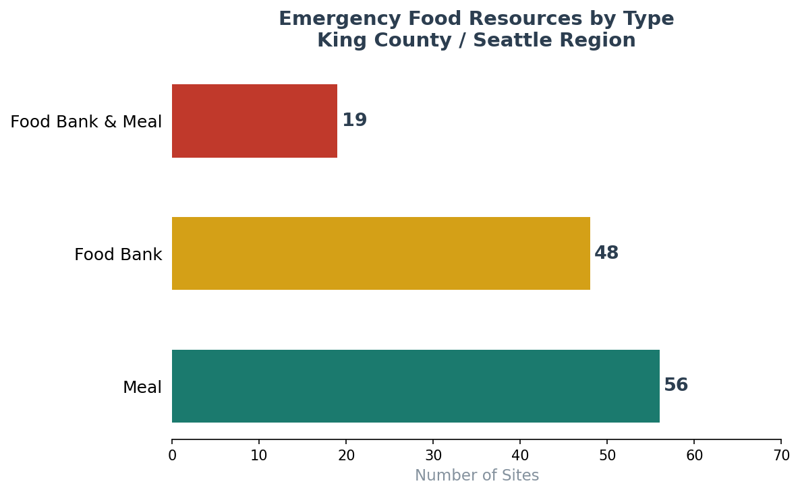
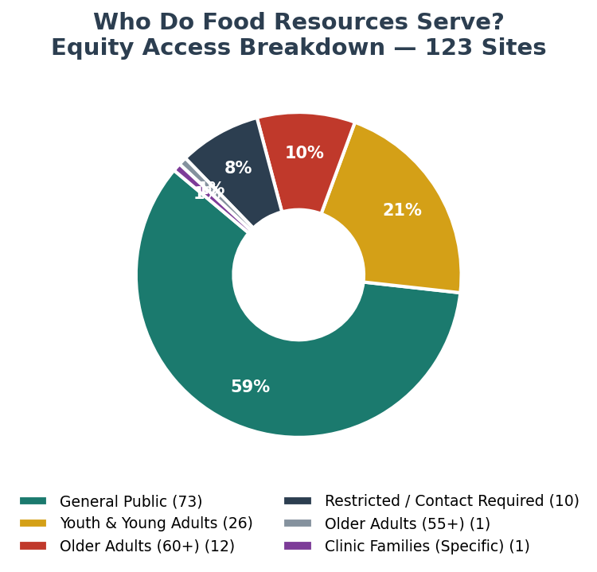
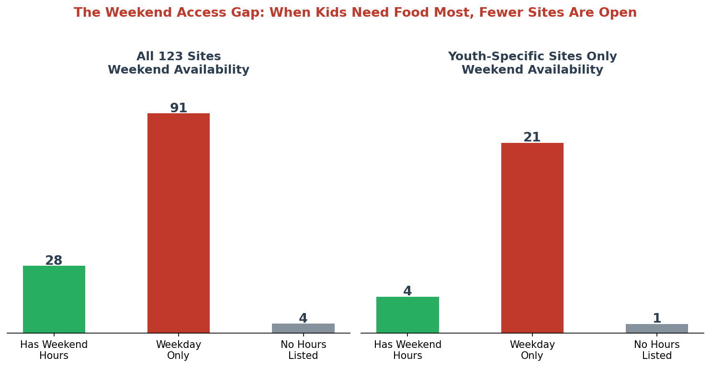
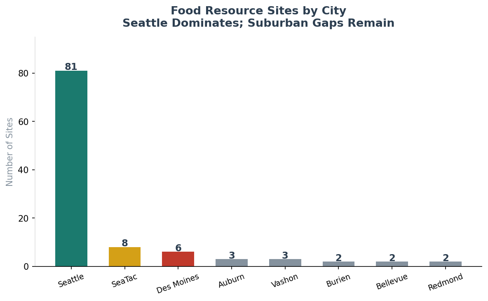
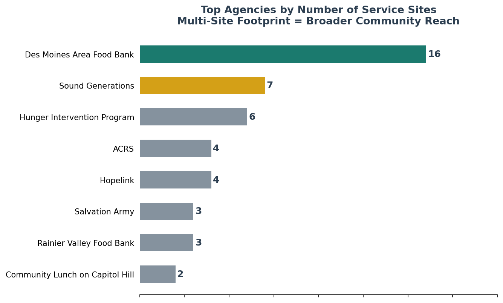
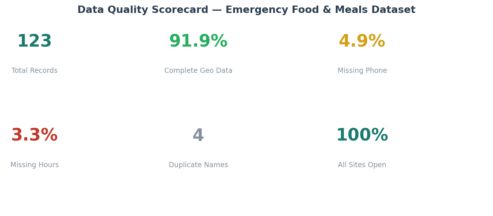

# Seattle Emergency Food Access Analysis
### A Data Quality & Equity Audit of King County's Food Resource Network
**Aastha Gade · June 2026 · [LinkedIn](https://linkedin.com/in/aasthagade) · [GitHub](https://github.com/aasthagade)**

---

## Why This Analysis

Seattle's Human Services Department (HSD) runs the Youth and Family Empowerment (YFE) Division — a network of programs designed to make sure every child and family in King County has access to food, support, and opportunity. As part of that mission, HSD publishes the **Emergency Food and Meals** dataset on Seattle's Open Data Portal: a living inventory of food banks, meal programs, and community kitchens across the region.

This analysis treats that dataset the same way a Data Analyst on HSD's Data Performance & Evaluation (DPE) team would — not just as a list of places, but as a data system worth validating, querying for equity signals, and surfacing actionable insights for program staff.

The goal: go beyond "here are 123 sites" and ask **who is being served, when, and where the gaps are.**

---

## Dataset

| Field | Detail |
|---|---|
| **Source** | [City of Seattle Open Data Portal](https://data.seattle.gov/Community/Emergency-Food-and-Meals-Seattle-and-King-County/kkzf-ntnu) |
| **Dataset ID** | `kkzf-ntnu` |
| **Owner** | Seattle Human Services Department |
| **Records** | 123 active food resource sites |
| **Geography** | Seattle + King County region |
| **Last Updated** | February 2026 |
| **License** | Public Domain |

**Fields analyzed:** `food_resource_type`, `agency`, `location`, `who_they_serve`, `address`, `latitude`, `longitude`, `days_hours`, `date_updated`

---

## Data Quality Assessment

Before drawing any conclusions, I ran a structured quality audit — the kind of validation work that underpins reliable dashboards and accurate reporting.

| Quality Check | Finding | Flag? |
|---|---|---|
| Total records | 123 | ✅ |
| Geolocation complete | 113/123 (91.9%) | ⚠️ 10 missing |
| Phone number present | 117/123 (95.1%) | Minor gap |
| Hours/days listed | 119/123 (96.7%) | ⚠️ 4 missing |
| Duplicate location names | 4 pairs | Review needed |
| Operational status | 100% marked "Open" | Verify currency |

**Key data quality finding:** 10 sites are missing latitude/longitude coordinates. This isn't just a cosmetic gap — it means those sites are invisible in any map-based dashboard or spatial analysis. For a department that routes families to the nearest resource, this is a meaningful data quality issue worth flagging to the data steward.

---

## Key Findings

### 1. Meal Programs Slightly Outnumber Food Banks



Of 123 active sites: **56 are meal programs**, **48 are food banks**, and **19 offer both**. The slight lean toward prepared meals suggests the network prioritizes immediate nutrition — especially relevant for populations without cooking access (unhoused individuals, youth in transitional housing).

---

### 2. Most Sites Are Open to Everyone — But 8% Have Hidden Barriers



- **59.3%** of sites are open to the General Public — no eligibility required
- **21.1%** specifically serve Youth & Young Adults
- **10.6%** serve Older Adults (55+/60+)
- **8.1%** require "contacting the agency" for eligibility information

That last group is worth a closer look. When a family in crisis needs food, a vague "call us first" requirement creates a real barrier — especially for households with limited English, unreliable phone access, or fear of documentation requirements. Standardizing eligibility language across these 10 sites would improve access and data consistency.

---

### 3. The Weekend Access Gap — Especially for Youth



This is the most striking finding in the dataset.

Across all 123 sites, **only 22.8% have weekend hours**. That's already a concern — but zoom into the **26 youth-specific sites** and it gets sharper:

> **85% of youth food sites are weekday-only.**

Only 4 out of 26 youth-focused programs operate on Saturdays or Sundays.

This is structurally misaligned with need. Summer months — when school-based lunch programs shut down — are precisely when food insecurity spikes for children. If a family loses school meals in June, they're relying on community programs. But most of those community programs for youth aren't open on the weekend.

This is an insight that directly connects to HSD's YFE Division mandate. Expanding weekend coverage at even a handful of high-traffic youth sites could meaningfully close this gap.

---

### 4. Seattle Is Well-Served — Suburban King County Less So



**66% of all food resource sites are located in Seattle proper.** Suburban communities like Auburn, Federal Way, Renton, and Burien collectively account for a much smaller share — despite representing a significant portion of King County's lower-income population.

This doesn't mean suburban residents are ignored, but it does suggest a geographic equity question worth surfacing in planning discussions: are site distributions proportional to where food-insecure families actually live?

---

### 5. A Handful of Agencies Carry Most of the Load



**Des Moines Area Food Bank** operates 16 sites — the largest single footprint in the dataset, all focused on youth meal distribution across SeaTac and Des Moines. **Sound Generations** (7 sites) leads senior nutrition. **Hunger Intervention Program** (6 sites) serves youth in North Seattle.

This concentration matters for program resilience: if one of these anchor agencies faces a funding gap or operational issue, a significant portion of the food network could be disrupted.

---

### 6. Data Quality Scorecard



Overall, the dataset is in decent shape — but the missing geocoordinates and inconsistent hours formatting are the most impactful gaps for operational use.

---

## Applying a Results-Based Accountability (RBA) Framework

HSD's DPE team uses RBA to connect data to community outcomes. Here's how this analysis maps onto that framework:

| RBA Question | Data Answer |
|---|---|
| **How much did we do?** | 123 active sites; 56 meal programs; 26 youth-focused |
| **How well did we do it?** | 91.9% complete geodata; 8.1% with access barriers; 3.3% missing hours |
| **Is anyone better off?** | 85% of youth sites have no weekend hours — structural gap in summer coverage |

---

## Recommendations

1. **Prioritize weekend youth meal expansion** — especially for summer months when school nutrition programs are unavailable. Even 2–3 additional Saturday sites in high-need zip codes would meaningfully close the gap.

2. **Geocode the 10 missing records** — enables full spatial analysis, routing, and map-based dashboard display. Flag to HSD data steward with addresses already in the dataset.

3. **Standardize eligibility disclosure** — the 10 "Contact Agency for Eligibility" sites should have consistent, plain-language descriptions of who qualifies and what documentation (if any) is needed.

4. **Schedule annual data refresh audit** — several sites show `date_updated` from 2025; with a dataset this operationally important, a systematic annual review process with site contacts would improve accuracy.

5. **Surface the suburban gap in planning conversations** — a simple equity map overlaying site density with SNAP enrollment or free/reduced lunch eligibility by zip code would make this gap visible to program planners.

---

## Methodology & Reproducibility

All analysis was performed in Python using `pandas`, `matplotlib`, and `numpy`. The raw dataset was pulled directly from the Seattle Open Data Portal API (`kkzf-ntnu`). Data cleaning steps, validation logic, and chart generation are fully documented in `notebook_analysis.py`.

```
seattle-food-access-analysis/
├── data/
│   └── emergency_food_meals_seattle.csv   ← raw dataset from data.seattle.gov
├── outputs/
│   ├── cleaned_data.csv                   ← validated, enriched dataset
│   ├── chart1_resource_types.png
│   ├── chart2_population_served.png
│   ├── chart3_weekend_gap.png
│   ├── chart4_top_agencies.png
│   ├── chart5_data_quality.png
│   └── chart6_geography.png
├── notebook_analysis.py                   ← full documented analysis script
└── README.md                              ← this file
```

To reproduce:
```bash
git clone https://github.com/aasthagade/seattle-food-access-analysis
cd seattle-food-access-analysis
pip install pandas matplotlib seaborn numpy
python notebook_analysis.py
```

---

## About This Project

This analysis was built as a portfolio project to demonstrate applied data skills relevant to human services analytics — specifically data validation, equity-centered analysis, and dashboard-ready reporting using public government data.

The dataset, methodology, and findings reflect publicly available information only.

**Connect:** [LinkedIn](https://linkedin.com/in/aasthagade) | [GitHub](https://github.com/aasthagade) | aastha.rdg@gmail.com
